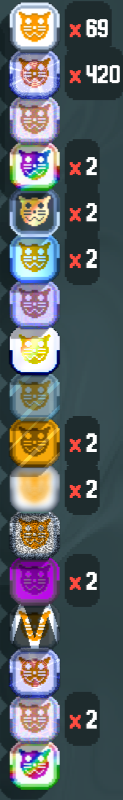

# BetterTagsPlus

This mod reimplements [Better Tags](https://github.com/WaffleDevs/BetterTags) by WaffleDevs to work with Cryptid Cat Tags.

Note that this mod removes the ability to combine Cat Tags automatically. I wouldn't be against adding a configuration option to enable that, if there's enough interest.

# Installation:

Download the source code archive and extract it into your mods folder.

# Dependencies and conflicts:

This mod depends on Cryptid.

This mod cannot be used with BetterTags.

# Features:

Perfect grouping of Cat Tags. Lowest levels are at the top and highest levels are at the bottom.

Works with all tags, not just Cat Tags.

Having a ton of unique Cat Tags doesn't result in the tags being rendered offscreen.

Ability to configure the location, visibility, and behavior of the count text.

Fixed the framerate drop after combining several hundred Cat Tags.

DebugPlus integration; run `kcr help` for a list of commands.

